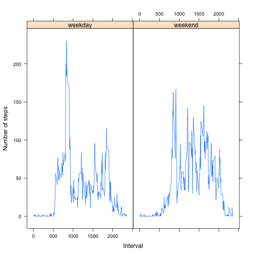

Reproducible Research: Peer Assessment 1
========================================================


<h3>Loading and preprocessing the data</h3>

```r
# Load the data
unzip("activity.zip")
orig_input <- read.csv("activity.csv", stringsAsFactors=FALSE)
# Process/transform the data (if necessary) into a format suitable for your analysis
input <- orig_input[!is.na(orig_input$steps),]
```

<h3>What is mean total number of steps taken per day?</h3>


```r
agg <- aggregate(input$steps, list(Date = input$date), sum)
names(agg) <- c("date", "steps")
# Make a histogram of the total number of steps taken each day
hist(agg$steps, xlab="Total number of steps taken each day", main="Histogram")
```

 

```r
# Calculate and report the mean and median total number of steps taken per day
mea <- mean(agg$steps)
med <- median(agg$steps)
```

Mean: 1.0766 &times; 10<sup>4</sup>  
Median: 10765

<h3>What is the average daily activity pattern?</h3>

```r
agg1 <- aggregate(steps ~ interval, data=input, FUN=mean)
names(agg1) <- c("interval", "steps")
# Make a time series plot (i.e. type = "l") of the 5-minute interval (x-axis) and the average number of steps taken, averaged across all days (y-axis)
plot(agg1$interval, agg1$steps, type='l', xlab="Interval", ylab="Average(Number of steps)", main="Time series plot")
```

 

```r
# Which 5-minute interval, on average across all the days in the dataset, contains the maximum number of steps?
max_interval <- agg1[agg1$steps==max(agg1$steps),]$interval
```

Interval with maximum number of steps: 835

<h3>Imputing missing values</h3>

```r
# Calculate and report the total number of missing values in the dataset (i.e. the total number of rows with NAs)
nas <- sum(is.na(orig_input$steps))
# Devise a strategy for filling in all of the missing values in the dataset.
```

Total number of missing values in the dataset: 2304

<h4>Strategy: Use the mean for the 5-minute interval</h4>


```r
# Create a new dataset that is equal to the original dataset but with the missing data filled in.
new_input <- orig_input
for(i in seq(1,nrow(new_input))) {
   if(is.na(new_input[i,"steps"])) {
        new_input[i,"steps"] <- agg1[agg1$interval == new_input[i,"interval"],"steps"]
    }
}
agg2 <- aggregate(new_input$steps, list(Date = new_input$date), sum)
names(agg2) <- c("date", "steps")
# Make a histogram of the total number of steps taken each day and Calculate and report the mean and median total number of steps taken per day
hist(agg2$steps, main="Histogram", xlab="Total number of steps taken each day ")
```

 

```r
mea <- mean(agg2$steps)
med <- median(agg2$steps)
```

New mean: 1.0766 &times; 10<sup>4</sup>  
New median: 1.0766 &times; 10<sup>4</sup>

<h3>Are there differences in activity patterns between weekdays and weekends?</h3>

```r
# Create a new factor variable in the dataset with two levels – “weekday” and “weekend” indicating whether a given date is a weekday or weekend day.
res <- (weekdays(as.Date(new_input$date, "%Y-%m-%d")) == "Sunday"  | weekdays(as.Date(new_input$date, "%Y-%m-%d")) == "Saturday")
new_input$day <- "weekday"
new_input[res,"day"] <- "weekend"
# Make a panel plot containing a time series plot 
library(lattice)
agg1 <- aggregate(steps ~ interval + day, data=new_input, FUN=mean)
xyplot(agg1$steps ~ agg1$interval | agg1$day, xlab="Interval", ylab="Number of steps", type="l")
```

 

